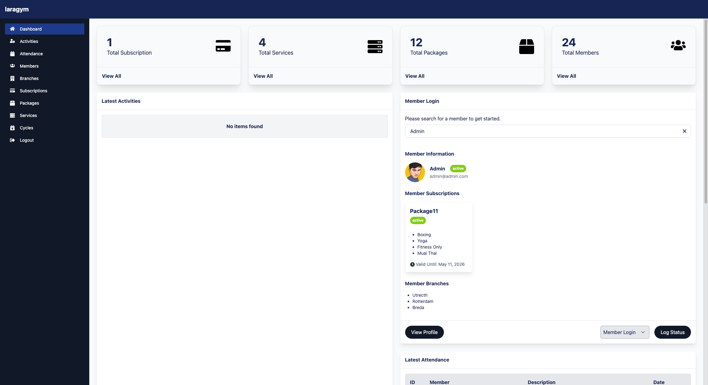
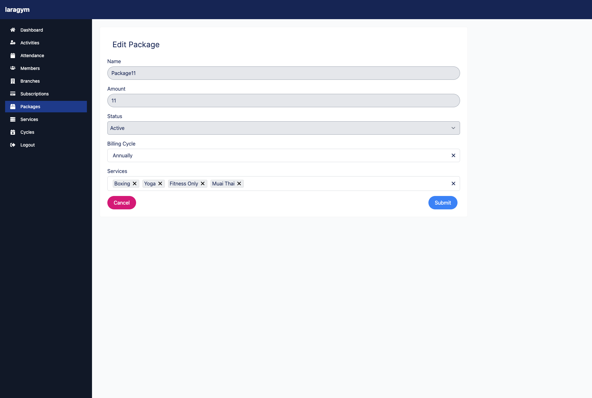

# Gym Management System

## Description

The Gym Management System is a web application designed to help gym owners and staff manage memberships, workouts, schedules, and payments. It provides an intuitive interface for users to track their fitness goals and manage their gym experience effectively.

## Features

- **User Authentication**: Secure login and registration for gym members and staff.
- **Membership Management**: Manage member profiles, membership plans, and payments.
- **Workout Tracking**: Users can log workouts, set fitness goals, and track progress.
- **Class Scheduling**: Create and manage group classes with scheduling features.
- **Admin Dashboard**: Admin panel to oversee memberships, payments, and class schedules.
- **Notifications**: Alerts for upcoming classes, payment reminders, and more.

## Tech Stack

- **Frontend**:  HTML, bootstrap
- **Backend**: Php
- **Database**: MySQL

  ## API Endpoints

### Authentication
- `POST /api/auth/register`: Register a new user.
- `POST /api/auth/login`: Login a user and get a JWT token.

### gym
- `GET /api/gym`: Get all projects for the logged-in user.
- `POST /api/newgym`: Create a new project.
- `PUT /api/gym/:id`: Update a project's priority.
- `DELETE /api/gymdelete/:id`: Delete a project.

### Notifications
- Notifications are sent via real-time updates when a project’s priority changes.

## Installation

1. Clone the repository:

   ```bash
   git clone https://github.com/yourusername/gym-management-system.git
   
## Screenshots





